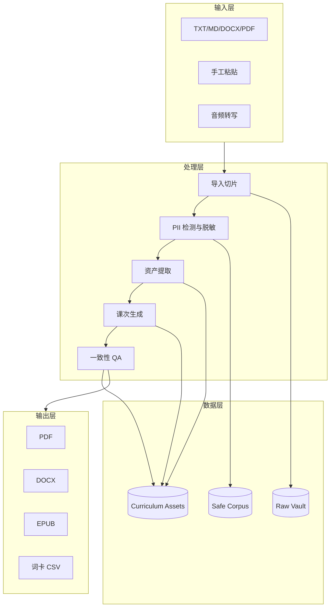
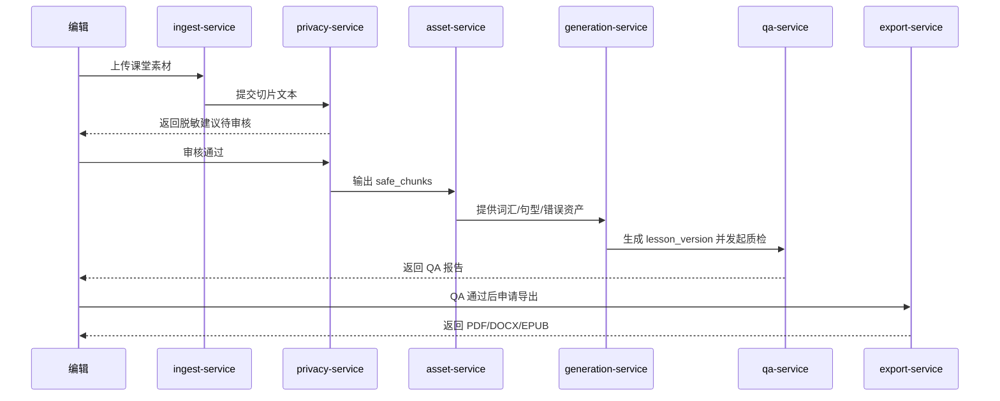
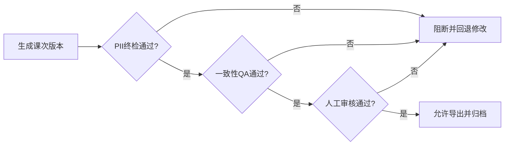
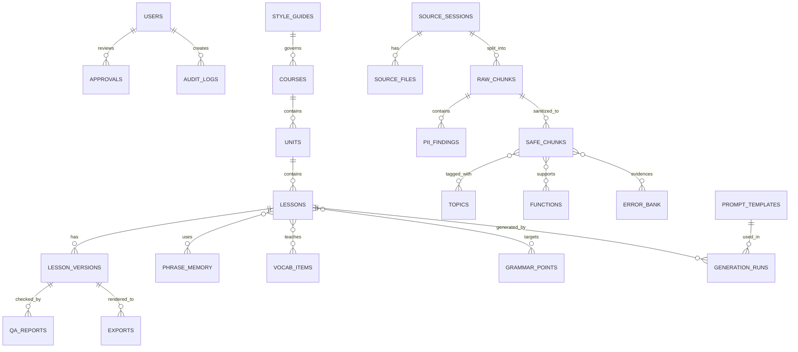
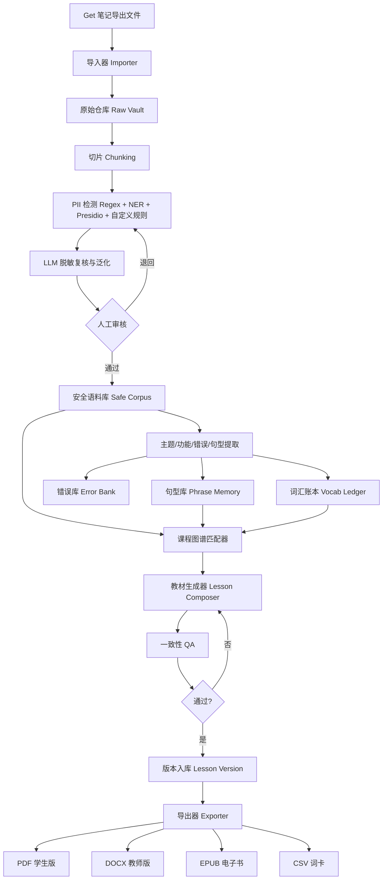
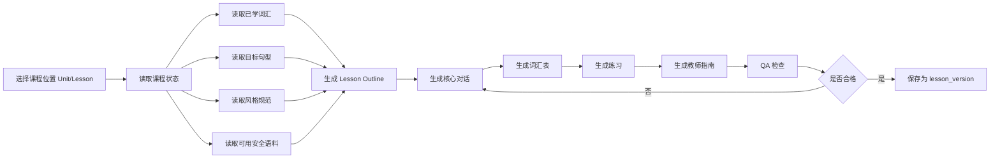
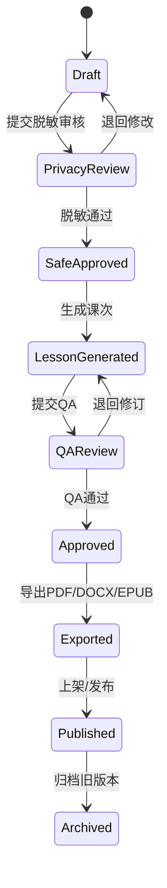
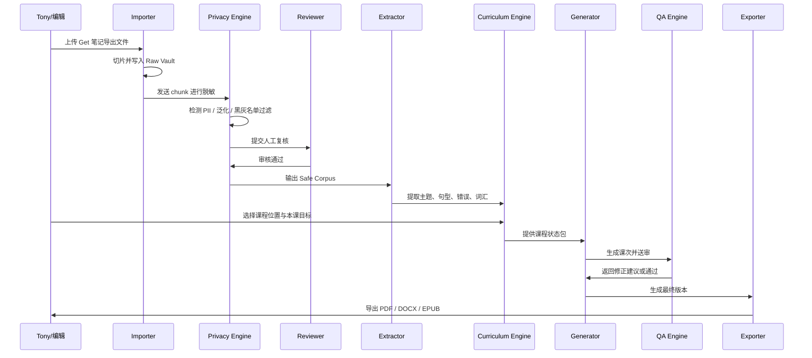
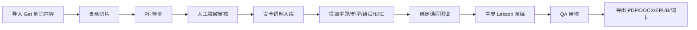

# 中文指南编写工具

## 0. 文档目标与成功定义

### 0.1 文档目标
将现有方案整理为“能直接进入开发与试运行”的技术蓝图，聚焦中文教材自动化输出。

### 0.2 成功定义
| 维度 | 目标值 | 验收方式 |
|---|---|---|
| 自动化闭环 | 端到端可跑通 | 导入到导出全链路完成 |
| 隐私合规 | 导出前 100% 终检 | QA 报告 + 人审记录 |
| 教材一致性 | 句型复用率 > 70% | 版本对比与统计 |
| 生产效率 | 单课 < 10 分钟 | 任务日志统计 |
| 可出版性 | PDF/DOCX 可直接使用 | 抽检 10 课 |

## 1. 需求总览（表格化）

### 1.1 业务需求矩阵
| 编号 | 需求 | 优先级 | 约束 | 输出物 |
|---|---|---|---|---|
| R1 | 导入课堂素材并切片 | P0 | 保留来源元数据 | RawChunk |
| R2 | 自动识别并脱敏隐私信息 | P0 | 高风险命中需阻断 | SafeChunk |
| R3 | 提取词汇/句型/错误点 | P0 | 可人工修订 | 资产标签 |
| R4 | 按课程图谱生成课次 | P0 | 难度和新词受控 | LessonVersion |
| R5 | 自动 QA 与发布闸门 | P0 | 不通过不可导出 | QAReport |
| R6 | 多格式导出 | P0 | 绑定版本号 | PDF/DOCX |
| R7 | EPUB 与词卡导出 | P1 | 模板稳定后开启 | EPUB/CSV |
| R8 | 多角色协作与审计 | P1 | 全操作可追溯 | AuditLog |

### 1.2 非功能需求矩阵
| 类别 | 指标 | 目标 |
|---|---|---|
| 安全 | PII 终检漏检率 | < 0.1% |
| 性能 | 单课生成耗时 | < 10 分钟 |
| 可用性 | 样本课程成功率 | ≥ 80% |
| 可追溯性 | 导出回溯能力 | 100% 可追溯 |
| 可维护性 | 模板/Prompt 版本化 | 100% 版本记录 |

## 2. 技术方案总图

### 2.1 分层架构图


### 2.2 服务拆分表
| 服务 | 核心职责 | 输入 | 输出 |
|---|---|---|---|
| ingest-service | 导入、切片、元数据 | 源文件 | raw_chunks |
| privacy-service | PII 检测、脱敏、人审流 | raw_chunks | safe_chunks |
| asset-service | 提取词汇/句型/错误 | safe_chunks | assets |
| generation-service | 按课程约束生成教材 | assets + 课程图谱 | lesson_versions |
| qa-service | 隐私与一致性校验 | lesson_versions | qa_reports |
| export-service | 文档渲染导出 | lesson_version + 模板 | exports |

### 2.3 技术选型建议
| 层 | 推荐 | 备选 | 选型依据 |
|---|---|---|---|
| 前端 | Next.js + React Query | React + Vite | 后台能力完整、生态成熟 |
| 后端 | FastAPI | NestJS | Python 在 NLP/PII 链路更高效 |
| 数据库 | PostgreSQL | MySQL | JSONB + 事务 + 扩展生态 |
| 队列 | Redis + Celery | Redis + BullMQ | 异步生成与导出任务 |
| 检索 | pgvector（V1） | ES/OpenSearch | 先简化架构后增强召回 |

## 3. 核心流程设计

### 3.1 自动化输出主流程


### 3.2 发布闸门流程


### 3.3 失败回退策略表
| 场景 | 检测点 | 回退动作 | 告警 |
|---|---|---|---|
| PII 漏检风险 | qa-service | 阻断导出，回到脱敏审核 | 高 |
| 新词超限 | generation-service | 自动替换候选词并重试 | 中 |
| 中英不对齐 | qa-service | 标记行级错误，进入编辑态 | 中 |
| 模板渲染失败 | export-service | 降级导出 Markdown 中间稿 | 中 |

### 3.4 重试与人工审核策略
| 类型 | 策略 | 说明 |
|---|---|---|
| 自动重试次数 | 2 次 | 仅对可恢复错误生效 |
| 人工审核门禁 | 必须通过 | 不允许跳过人工审核 |
| 发布条件 | PII + QA + Reviewer 三通过 | 任一失败直接阻断导出 |
| EPUB 策略 | 暂不进入主路径 | 保留在扩展阶段实现 |

## 4. ASCII 原型图（便于团队快速对齐）

### 4.1 工作台首页
```text
+----------------------------------------------------------------------------------+
| 中文指南编写工具  | 项目: Beginner CN A1 | 版本: v0.9 | 用户: 主编              |
+----------------------------------------------------------------------------------+
| [导入] [脱敏审核] [资产提取] [课程生成] [QA中心] [导出中心] [设置]              |
+---------------------------+------------------------------------------------------+
| 今日任务                  | 流水线状态                                           |
| - 待审核脱敏: 12          | 导入 -> 脱敏 -> 资产 -> 生成 -> QA -> 导出           |
| - 待修复QA: 5             |   ✓      ✓       ✓       ✓      !       -            |
| - 待导出: 3               | 当前阻塞: Lesson-12 中英对齐失败                     |
+---------------------------+------------------------------------------------------+
```

### 4.2 课次编辑与QA联动页
```text
+----------------------------------------------------------------------------------+
| Lesson 12: 在餐厅点餐 | 难度 A1 | 新词 8/10 | 句型复用 76% | QA: 2项未通过         |
+-----------------------------------+----------------------------------------------+
| 左侧: 教材正文编辑区              | 右侧: QA 面板                                |
| 01 对话                           | [!] 行 14: 拼音缺失                         |
| 02 词汇表                         | [!] 行 22: 英文与中文语义不一致             |
| 03 句型讲解                       | [i] 建议替换词: "delicious" -> "tasty"      |
| 04 练习题                         | [OK] 隐私扫描通过                            |
+-----------------------------------+----------------------------------------------+
| [保存草稿] [重新QA] [提交审核] [导出PDF] [导出DOCX] [导出EPUB]                  |
+----------------------------------------------------------------------------------+
```

### 4.3 脱敏审核页
```text
+----------------------------------------------------------------------------------+
| 脱敏审核任务 #R20260324-08 | 来源: Get Note | 状态: 待审核                          |
+--------------------------+-------------------------------+---------------------------------------+
| 原文片段                 | 识别结果                      | 操作                                  |
| "Amy住在上海浦东..."     | [姓名][地址] 高风险           | (替换) [学生姓名] [某城市]           |
| "她电话是139..."         | [手机号] 高风险               | (删除)                                |
| "她喜欢川菜..."          | 无敏感信息                    | (保留)                                |
+--------------------------+-------------------------------+---------------------------------------+
| [批量通过] [批量驳回] [提交安全语料]                                                |
+----------------------------------------------------------------------------------+
```

## 5. 数据模型与接口（压缩版）

### 5.1 最小数据表（MVP）
| 表 | 用途 | 必备字段 |
|---|---|---|
| raw_chunks | 原始分片 | chunk_id, session_id, raw_text |
| pii_findings | 隐私命中 | finding_id, chunk_id, category, action |
| safe_chunks | 脱敏语料 | safe_chunk_id, source_chunk_id, clean_text, approved |
| phrase_memory | 句型标准库 | phrase_id, en_text, zh_text, level |
| lesson_versions | 课次版本 | version_id, lesson_id, content_json, status |
| qa_reports | QA结果 | report_id, version_id, privacy_score, consistency_score |
| exports | 导出记录 | export_id, version_id, format, file_path |

### 5.2 核心 API（MVP）
| 方法 | 路径 | 用途 | 响应关键字段 |
|---|---|---|---|
| POST | /imports | 上传并切片 | sessionId, chunkCount |
| POST | /privacy/runs | 发起脱敏检测 | runId, findingsCount |
| POST | /privacy/reviews/{runId}/approve | 提交脱敏审核 | approvedCount |
| POST | /assets/extract | 提取教学资产 | vocabCount, phraseCount |
| POST | /lessons/generate | 生成课次 | versionId, warnings |
| POST | /qa/check/{versionId} | 执行 QA | pass, issues |
| POST | /exports | 导出教材 | exportId, format, status |
| GET | /exports/{exportId} | 获取导出结果 | downloadUrl |

## 6. 里程碑计划（高可行性版本）
| 阶段 | 目标 | 产出 | 退出条件 |
|---|---|---|---|
| Sprint 1 | 跑通闭环 | 导入/脱敏/生成/PDF | 3 节课稳定导出 |
| Sprint 2 | 稳定质量 | QA 规则 + 词汇约束 | QA 首过率 > 70% |
| Sprint 3 | 提升效率 | 批量任务 + 审核提速 | 单课 < 10 分钟 |
| Sprint 4 | 扩展出版 | EPUB/词卡/模板管理 | 10 节课连续通过 |

## 7. 已确认决策与待讨论问题

### 7.1 已确认决策（已冻结）
| 决策项 | 已确认方案 | 状态 |
|---|---|---|
| 人工审核门禁 | 不允许跳过，必须人工审核 | 已确认 |
| 分级新词上限 | 按科目一分级策略执行 | 已确认 |
| EPUB 排期 | 先不进入主路径 | 已确认 |
| 自动重试策略 | 失败自动重试 2 次 | 已确认 |
| 句型冲突策略 | 主句型 + 别名 | 已确认 |
| Prompt 版本治理 | 每次发布绑定 prompt_version | 已确认 |
| QA 责任分工 | Editor 修订，Reviewer 复审 | 已确认 |
| 溯源粒度 | 课次级 + 句型级 | 已确认 |

### 7.2 科目一分级新词上限表（执行口径）
| 级别 | 单课新词上限 | 强制动作 |
|---|---|---|
| A1-入门 | 10 | 超限时阻断并替换候选词 |
| A1+过渡 | 12 | 超限时阻断并替换候选词 |
| A2-基础 | 15 | 超限时阻断并替换候选词 |

### 7.3 仍需讨论的问题（不阻塞首期开发）
| 问题 | 影响模块 | 建议默认值 |
|---|---|---|
| 黄金数据集抽样规则如何定 | QA、回归测试 | 每课抽样 3 段核心片段 |
| 术语表冲突的仲裁流程 | 资产提取、生成 | 主编最终裁定 |
| 导出模板变更的发布节奏 | 导出服务 | 每周固定窗口发布 |
| 失败任务的人工接管 SLA | 运维与生产 | 4 小时内处理 |

### 7.4 建议继续保留的默认策略
| 策略 | 默认值 | 说明 |
|---|---|---|
| PII 规则与模型冲突 | 规则优先，模型补充 | 避免高风险漏检 |
| 向量检索 | V1 再上 pgvector | MVP 降低复杂度 |
| 导出模板维护 | 主编审批，运营维护 | 保证业务一致性 |
| 指标周报 | Sprint 3 自动生成 | 提升运营效率 |

## 8. 下一步执行建议（本周可落地）
1. 固化 P0 范围并冻结 2 周：不再新增功能需求。
2. 将“人工审核必过”写入发布闸门，接口层禁止绕过。
3. 落地科目一新词阈值表并接入生成器校验逻辑。
4. 先实现 PDF/DOCX 双导出，EPUB 暂不进入主路径。
5. 开启失败任务自动重试 2 次，超过阈值进入人工接管队列。
6. 选 FastAPI + PostgreSQL + Redis，降低首期复杂度。
7. 制作 10 节样本“黄金数据集”用于回归。
8. 每日跟踪 4 个核心指标：通过率、耗时、漏检、复用率。

---

## 附录：详细设计（保留原始扩展版）

# 一、PRD：隐私优先教材中台

## 1.1 产品定义

### 产品名称
**隐私优先教材中台**  
英文可命名为：**Privacy-First Curriculum OS**

### 产品定位
一个面向中文教学作者/教研者的**内部生产系统**，用于把 Get 笔记中的教学内容，经过**脱敏、提炼、课程化、标准化、出版化**，最终输出可售卖的电子教材与教师指南。

### 一句话定义
> 把“真实课堂内容”安全地变成“可复用、可出版、可持续扩写”的中文教材资产。

---

## 1.2 背景

你现在已经有大量高价值资产沉淀在 Get 笔记里，但这些内容存在几个现实问题：

### 现状问题
1. **内容有价值，但不适合直接出版**
   - 混有姓名、家庭信息、个人经历、行政沟通、闲聊等

2. **真实课堂有效，但不够结构化**
   - 很多表达是临场解释，不是教材格式

3. **素材多，但难以稳定复用**
   - 没有统一词汇账本、句型库、错误库、课程图谱

4. **AI 可生成，但容易跑偏**
   - 风格漂移、难度失控、前后课不连贯、翻译不统一

5. **你真正要卖的是教材，不是原始笔记**
   - 所以必须从“素材管理”升级到“教材中台”

---

## 1.3 产品目标

### 核心目标
建立一套系统，让你能够持续把 Get 笔记内容转成：

- 初级中文电子教材
- 教师教学指南
- 练习册
- 词卡
- 音频录制脚本
- 后续可扩展的课程包

### 具体目标
| 目标编号 | 目标 | 衡量标准 |
|---|---|---|
| G1 | 脱敏安全 | 导出前 PII 漏出率接近 0，所有导出经过强制终检 |
| G2 | 课程一致性 | 新生成课次与既有课程图谱、词汇账本、句型库保持一致 |
| G3 | 生产效率 | 单课从素材到初稿控制在 10 分钟以内 |
| G4 | 内容复用 | 同一份结构化内容可一键导出 PDF/DOCX/EPUB/词卡 |
| G5 | 商业可用 | 可形成系列化电子教材商品，而不是单篇内容 |

---

## 1.4 非目标

这很重要，先砍掉不该做的。

### 本阶段不做
1. 不做学生端 App
2. 不做公开社区平台
3. 不做实时直播教学系统
4. 不做全自动无审核出版
5. 不做高阶 HSK/学术中文全覆盖
6. 不做多租户 SaaS 作为第一阶段核心

### 直白建议
**先做你自己能稳定用的私有生产后台。**  
别一开始做“大而全平台”。

---

## 1.5 目标用户

### 核心用户画像

#### 用户 1：内容负责人 / 主编（你）
- 导入课堂内容
- 设置课程方向
- 审核脱敏结果
- 决定教材结构
- 输出可销售产品

#### 用户 2：教研编辑
- 标注主题、句型、错误
- 审核生成内容
- 优化活动与练习
- 调整教师指南

#### 用户 3：运营/出版人员
- 导出 PDF/EPUB
- 管理版本
- 产出商品页素材

### 未来扩展用户
- 其他中文老师
- 教培机构教研团队
- 合作编辑

---

## 1.6 核心使用场景

### 场景 A：课堂内容清洗
你从 Get 笔记导出一节课的内容，系统自动：
- 分段
- 找出隐私信息
- 删除或泛化
- 只保留教学可用部分

### 场景 B：提取教学资产
系统从已脱敏内容中提取：
- 主题
- 高频句型
- 常见错误
- 教师讲解策略
- 可转化的练习点

### 场景 C：生成教材课次
你输入“主题 + 目标级别 + 课程位置”，系统自动生成：
- 对话
- 双语逐句对照
- 词汇表
- 句型讲解
- 发音提示
- 练习
- 教师备注

### 场景 D：导出出版物
系统把课次导出成：
- 学生版 PDF
- 教师版 DOCX
- EPUB
- Flashcards CSV

---

## 1.7 产品范围（MVP / V1 / V2）

## MVP（必须做）
### P0 功能
1. Get 笔记内容导入
2. 原始内容入库
3. 自动脱敏
4. 人工审核脱敏结果
5. 安全语料入库
6. 主题/句型/错误提取
7. 课程图谱管理
8. 课次生成
9. 一致性 QA
10. 导出 PDF/DOCX
11. 版本管理
12. 审计日志

## V1（建议做）
### P1 功能
1. 词汇账本自动复现控制
2. 句型记忆库自动推荐
3. Flashcards 导出
4. EPUB 导出
5. 向量检索（从安全语料检索相关片段）
6. 多模板导出（学生版/教师版/练习版）

## V2（后续扩展）
### P2 功能
1. 多角色协作评论
2. 自动生成 PPT/课堂活动卡
3. 素材与课次双向追溯
4. 半自动音频脚本与配音流程
5. API 级接入第三方笔记系统
6. 多课程线并行管理（商务中文、旅行中文等）

---

## 1.8 功能模块设计

# 模块一：数据导入模块

### 输入
- TXT / Markdown / DOCX / PDF
- 音频转写文本
- 字幕文件（SRT/VTT）
- 手工粘贴文本

### 需求
- 记录来源、导入时间、课程日期、标签
- 自动切分为 chunk（语义片段）
- 标注说话角色（老师/学生/未知）

### 验收标准
- 一次可导入单个或多个文件
- 导入后自动生成 chunk
- 支持手动修正 chunk

---

# 模块二：脱敏与敏感过滤模块

### 处理原则
遵循 [GDPR Article 5](https://gdpr-info.eu/art-5-gdpr/) 的“最小必要”和“目的限制”，并参考 [ICO 匿名化指导](https://ico.org.uk/for-organisations/uk-gdpr-guidance-and-resources/data-sharing/anonymisation/)。

### 识别内容
- 人名
- 家庭成员具体信息
- 电话
- 邮箱
- 地址
- 公司/学校具体名称
- 出生日期/年龄
- 财务信息
- 健康信息
- 其他敏感话题

### 处理动作
| 类型 | 动作 |
|---|---|
| 必删 | 直接删除 |
| 必替换 | 替换成占位符，如 `[学生姓名]` |
| 必泛化 | 改为“某城市/某公司/某学生/家庭成员” |
| 可保留 | 仅保留抽象教学点 |

### 技术策略
- Regex
- 自定义敏感词表
- NER 模型
- LLM 二次复核
- 人工终审

### 验收标准
- 每条导出前必须有最终 PII 扫描
- 所有被标记内容可追踪
- 可人工确认“保留/删除/泛化”

---

# 模块三：教学知识提取模块

### 提取对象
- 主题 topic
- 交际功能 function
- 高频词汇
- 核心句型
- 语法点
- 发音点
- 常见错误
- 教师解释策略
- 课堂活动形式

### 输出
- 安全语料块
- 主题标签
- 错误库
- 句型库候选项
- 词汇库候选项

### 验收标准
- 每个 safe chunk 至少带 1 个主题标签
- 可人工修订标签
- 错误库能回链到原始安全语料

---

# 模块四：课程图谱模块

### 目标
确保“新课不是随便写”，而是嵌入已有课程系统。

### 结构
```text
Course
└── Unit
    └── Lesson
        ├── Can-do
        ├── Scenario
        ├── New vocab
        ├── Recycled vocab
        ├── Target phrases
        ├── Grammar focus
        ├── Dialogue
        ├── Exercises
        └── Teacher notes
```

### 对齐标准
- 课程目标参考 [ACTFL Can-Do Statements](https://www.actfl.org/educator-resources/ncssfl-actfl-can-do-statements/)
- 能力层级对齐 [ACTFL Proficiency Guidelines](https://www.actfl.org/educator-resources/actfl-proficiency-guidelines/) 与 [CEFR](https://www.coe.int/en/web/common-european-framework-reference-languages)

### 验收标准
- 每课必须绑定 can-do
- 每课有新词上限
- 每课必须标记复现旧词
- 每课必须依附某单元目标

---

# 模块五：句型记忆库 / Phrase Memory

### 这是整个系统的核心资产
用于保证：
- 英文表达固定映射
- 中文表达统一
- 拼音统一
- 释义统一
- 避免同一意思多种随意写法

### 示例
| English | 中文 | Pinyin | Gloss | Level |
|---|---|---|---|---|
| What’s your name? | 你叫什么名字？ | Nǐ jiào shénme míngzi? | you / called / what / name | A1 |
| My name is… | 我叫…… | Wǒ jiào… | I / am called… | A1 |

### 验收标准
- 生成课文时优先调用 phrase memory
- 若新增句型，需审核后入库
- 保留版本号，避免覆盖历史教材

---

# 模块六：教材生成模块

### 输入
- 课程位置（Course/Unit/Lesson）
- 本课主题
- can-do 目标
- 可用 safe chunks
- 允许新词
- 可复用句型
- 风格规则

### 输出
- 学生版课次草稿
- 教师版草稿
- 练习
- 课后任务
- 复习词卡

### 学生版固定模板
1. 本课目标
2. 场景导入
3. 核心对话
4. 英文—中文—拼音—结构释义
5. 重点词汇
6. 目标句型
7. 发音提示
8. 控制性练习
9. 输出任务
10. 复习卡片

### 教师版固定模板
1. 教学目标
2. 课堂流程
3. 板书建议
4. 发音难点
5. 易错提醒
6. 延展活动
7. 作业与答案

### 验收标准
- 不得使用未授权新词
- 不得超出当前课程难度
- 中英对齐必须完整
- 生成内容必须保留来源链路

---

# 模块七：一致性 QA 模块

### 自动检查项
- 是否超纲词
- 是否重复表达不统一
- 是否漏拼音
- 是否中英不匹配
- 是否缺少复现词
- 是否不符合风格规范
- 是否残留隐私信息
- 是否出现黑名单话题

### 验收标准
- 未通过不得导出
- 输出 QA 报告
- 可回退修改再审

---

# 模块八：导出与出版模块

### 输出格式
- PDF
- DOCX
- EPUB
- CSV（词卡）
- Markdown

### 标准
EPUB 导出建议对齐 [EPUB 3.3](https://www.w3.org/TR/epub-33/)

### 验收标准
- 所有导出带版本号
- 可追溯到 lesson_version
- 导出前强制终检一次隐私和 QA 状态

---

## 1.9 权限模型

| 角色 | 权限 |
|---|---|
| Admin / Owner | 全部权限，包括导入、审批、导出、删除 |
| Editor | 审核 safe chunk、修改课次、提交版本 |
| Reviewer | 只做 QA、脱敏审核、批准发布 |
| Operator | 导出、打包、发布，不可改原始内容 |

### 建议
第一阶段先做**单租户 + 角色权限**。  
不要急着上多租户 SaaS。

---

## 1.10 非功能要求

### 隐私与安全
- 原始数据与安全语料分层隔离
- 原始数据默认不进入导出
- 导出前强制再跑 PII 扫描
- 敏感字段加密存储
- 有审计日志
- 最小权限原则
- 安全设计参考 [OWASP Top 10](https://owasp.org/www-project-top-ten/)

### 性能
- 单次导入 1 小时课程文本不崩
- 生成单课初稿 < 10 分钟
- 检索 safe corpus < 3 秒

### 可追溯性
- 每节课知道来自哪些 safe chunks
- 每个句型知道首次出现在哪一课
- 每个导出版本可回溯

### 可维护性
- Prompt 模板版本化
- 课程模板版本化
- 导出模板版本化

---

## 1.11 成功指标（KPI）

| 指标 | 目标 |
|---|---|
| PII 终检漏出率 | < 0.1%（最终导出前人工+自动双保险） |
| 单课生成耗时 | < 10 分钟 |
| 课次 QA 首次通过率 | > 80% |
| 句型复用率 | > 70% |
| 教材导出可直接使用率 | > 85% |
| 每周稳定产出 | 5–10 课 |

---

## 1.12 版本路线图

### Phase 1（2–3 周）
- 导入
- chunk 切分
- 脱敏
- safe corpus
- 基础人工审核页

### Phase 2（2–4 周）
- 主题/句型/错误提取
- 课程图谱
- phrase memory
- vocab ledger

### Phase 3（2–4 周）
- 课次生成器
- QA 检查器
- PDF/DOCX 导出

### Phase 4（2–3 周）
- EPUB/词卡导出
- 版本管理
- 审计面板

---

# 二、数据库结构

## 2.1 数据库设计原则

### 原则 1：分层存储
分三层：

1. **Raw Vault**：原始内容
2. **Safe Corpus**：脱敏后的安全教学语料
3. **Curriculum Assets**：课程与出版资产

### 原则 2：课程对象结构化
不要只存 Word 文本。  
要存：
- 词汇
- 句型
- 对话
- 练习
- 版本
- 来源映射

### 原则 3：可追溯
每个 lesson_version 都应知道它引用了哪些 safe chunks。

---

## 2.2 数据表总览

## A. 原始数据层 Raw Vault

| 表名 | 用途 | 关键字段 |
|---|---|---|
| `source_sessions` | 一次导入/一节课的源记录 | session_id, source_name, source_type, imported_at |
| `source_files` | 导入的原始文件 | file_id, session_id, file_name, file_type, storage_path |
| `raw_chunks` | 原始切片 | chunk_id, session_id, chunk_no, raw_text, speaker_role |
| `pii_findings` | 隐私识别结果 | finding_id, chunk_id, category, match_text_hash, action |
| `redaction_runs` | 每次脱敏任务记录 | run_id, session_id, engine_version, status |

## B. 安全语料层 Safe Corpus

| 表名 | 用途 | 关键字段 |
|---|---|---|
| `safe_chunks` | 已脱敏可用语料 | safe_chunk_id, source_chunk_id, clean_text, generalized_text, approved |
| `topics` | 主题词典 | topic_id, name, parent_topic_id |
| `chunk_topic_map` | 语料与主题关系 | safe_chunk_id, topic_id |
| `functions` | 交际功能 | function_id, name |
| `chunk_function_map` | 语料与功能关系 | safe_chunk_id, function_id |
| `error_bank` | 学员常见错误库 | error_id, wrong_form, correct_form, explanation, level |
| `chunk_error_map` | 语料关联错误点 | safe_chunk_id, error_id |

## C. 课程资产层 Curriculum Assets

| 表名 | 用途 | 关键字段 |
|---|---|---|
| `courses` | 课程主表 | course_id, title, target_level, audience |
| `units` | 单元表 | unit_id, course_id, title, sequence_no |
| `lessons` | 课次主表 | lesson_id, unit_id, title, sequence_no, can_do |
| `lesson_versions` | 每节课版本 | version_id, lesson_id, version_no, status, content_json |
| `phrase_memory` | 句型记忆库 | phrase_id, en_text, zh_text, pinyin, gloss, level |
| `vocab_items` | 词汇库 | vocab_id, hanzi, pinyin, english, pos, level |
| `grammar_points` | 语法点库 | grammar_id, title, explanation, level |
| `lesson_phrase_map` | 课次-句型关联 | lesson_id, phrase_id, is_target, order_no |
| `lesson_vocab_map` | 课次-词汇关联 | lesson_id, vocab_id, is_new, order_no |
| `lesson_grammar_map` | 课次-语法点关联 | lesson_id, grammar_id |

## D. 生成、审核与导出层

| 表名 | 用途 | 关键字段 |
|---|---|---|
| `generation_runs` | 生成任务记录 | run_id, lesson_id, prompt_version, model_name, status |
| `qa_reports` | QA 检查结果 | report_id, version_id, privacy_score, consistency_score |
| `exports` | 导出记录 | export_id, version_id, format, file_path, exported_at |
| `approvals` | 审批流 | approval_id, object_type, object_id, status, reviewer_id |
| `audit_logs` | 审计日志 | log_id, actor_id, action, target_type, target_id, created_at |

## E. 系统配置层

| 表名 | 用途 | 关键字段 |
|---|---|---|
| `users` | 用户表 | user_id, name, email, role |
| `style_guides` | 风格规范 | style_id, name, rules_json |
| `prompt_templates` | Prompt 模板 | prompt_id, name, version, template_text |
| `policy_rules` | 黑名单/灰名单/脱敏策略 | rule_id, rule_type, pattern, action |

---

## 2.3 关键数据关系图（ERD）



---

## 2.4 推荐字段设计（核心表）

## 1）`source_sessions`
```sql
create table source_sessions (
  session_id uuid primary key,
  source_name text not null,
  source_type text not null, -- get_note_export / txt / pdf / srt / audio_transcript
  class_date timestamptz,
  language_pair text default 'en-zh',
  imported_by uuid,
  imported_at timestamptz default now(),
  metadata jsonb default '{}'::jsonb
);
```

## 2）`raw_chunks`
```sql
create table raw_chunks (
  chunk_id uuid primary key,
  session_id uuid not null references source_sessions(session_id) on delete cascade,
  chunk_no int not null,
  speaker_role text default 'unknown', -- teacher / student / unknown
  start_ts numeric,
  end_ts numeric,
  raw_text text not null,
  raw_text_hash text,
  created_at timestamptz default now()
);

create index idx_raw_chunks_session on raw_chunks(session_id, chunk_no);
```

## 3）`pii_findings`
```sql
create table pii_findings (
  finding_id uuid primary key,
  chunk_id uuid not null references raw_chunks(chunk_id) on delete cascade,
  category text not null, -- name / phone / email / address / family / company / health / finance
  severity text not null, -- low / medium / high
  match_text_hash text,
  match_preview text,
  suggested_action text not null, -- delete / replace / generalize
  replacement_text text,
  confidence numeric(5,4),
  detector text, -- regex / presidio / llm / manual
  status text default 'pending', -- pending / confirmed / dismissed
  created_at timestamptz default now()
);

create index idx_pii_findings_chunk on pii_findings(chunk_id);
```

## 4）`safe_chunks`
```sql
create table safe_chunks (
  safe_chunk_id uuid primary key,
  source_chunk_id uuid not null references raw_chunks(chunk_id) on delete cascade,
  clean_text text not null,
  generalized_text text,
  approved boolean default false,
  approval_status text default 'pending', -- pending / approved / rejected
  risk_score numeric(5,4) default 0,
  reviewer_id uuid,
  reviewed_at timestamptz,
  metadata jsonb default '{}'::jsonb,
  embedding vector(1536)
);
```

> 如果你暂时不用向量检索，可以先去掉 `embedding` 字段；后面再加。

## 5）`phrase_memory`
```sql
create table phrase_memory (
  phrase_id uuid primary key,
  en_text text not null,
  zh_text text not null,
  pinyin text,
  gloss text,
  usage_note text,
  level text, -- ACTFL/CEFR 标记
  first_lesson_id uuid,
  status text default 'approved', -- draft / approved / deprecated
  normalized_hash text unique,
  created_at timestamptz default now(),
  updated_at timestamptz default now()
);

create index idx_phrase_memory_level on phrase_memory(level);
create index idx_phrase_memory_zh on phrase_memory(zh_text);
```

## 6）`vocab_items`
```sql
create table vocab_items (
  vocab_id uuid primary key,
  hanzi text not null,
  pinyin text,
  english text not null,
  pos text,
  level text,
  usage_note text,
  normalized_hash text unique,
  created_at timestamptz default now()
);

create index idx_vocab_hanzi on vocab_items(hanzi);
```

## 7）`courses`
```sql
create table courses (
  course_id uuid primary key,
  title text not null,
  subtitle text,
  audience text, -- adult beginners / business learners
  target_level text, -- ACTFL Novice Low / CEFR A1
  language_support text default 'English',
  style_id uuid,
  status text default 'draft',
  created_at timestamptz default now()
);
```

## 8）`units`
```sql
create table units (
  unit_id uuid primary key,
  course_id uuid not null references courses(course_id) on delete cascade,
  title text not null,
  sequence_no int not null,
  objectives jsonb default '[]'::jsonb,
  created_at timestamptz default now(),
  unique(course_id, sequence_no)
);
```

## 9）`lessons`
```sql
create table lessons (
  lesson_id uuid primary key,
  unit_id uuid not null references units(unit_id) on delete cascade,
  title text not null,
  sequence_no int not null,
  can_do text not null,
  scenario text,
  level text,
  status text default 'draft',
  created_at timestamptz default now(),
  updated_at timestamptz default now(),
  unique(unit_id, sequence_no)
);
```

## 10）`lesson_versions`
```sql
create table lesson_versions (
  version_id uuid primary key,
  lesson_id uuid not null references lessons(lesson_id) on delete cascade,
  version_no int not null,
  status text default 'draft', -- draft / qa_passed / approved / exported
  content_json jsonb not null,
  source_refs jsonb default '[]'::jsonb, -- safe_chunk_ids / phrase_ids / vocab_ids
  notes text,
  created_by uuid,
  created_at timestamptz default now(),
  unique(lesson_id, version_no)
);

create index idx_lesson_versions_lesson on lesson_versions(lesson_id, version_no desc);
create index idx_lesson_versions_content on lesson_versions using gin(content_json);
```

## 11）`lesson_phrase_map`
```sql
create table lesson_phrase_map (
  lesson_id uuid not null references lessons(lesson_id) on delete cascade,
  phrase_id uuid not null references phrase_memory(phrase_id) on delete cascade,
  is_target boolean default false,
  order_no int,
  primary key (lesson_id, phrase_id)
);
```

## 12）`lesson_vocab_map`
```sql
create table lesson_vocab_map (
  lesson_id uuid not null references lessons(lesson_id) on delete cascade,
  vocab_id uuid not null references vocab_items(vocab_id) on delete cascade,
  is_new boolean default true,
  order_no int,
  primary key (lesson_id, vocab_id)
);
```

## 13）`qa_reports`
```sql
create table qa_reports (
  report_id uuid primary key,
  version_id uuid not null references lesson_versions(version_id) on delete cascade,
  privacy_score numeric(5,2),
  consistency_score numeric(5,2),
  pedagogy_score numeric(5,2),
  translation_score numeric(5,2),
  status text not null, -- pass / fail / warning
  findings jsonb default '[]'::jsonb,
  reviewed_by uuid,
  created_at timestamptz default now()
);
```

## 14）`exports`
```sql
create table exports (
  export_id uuid primary key,
  version_id uuid not null references lesson_versions(version_id) on delete cascade,
  format text not null, -- pdf / docx / epub / csv / md
  file_path text not null,
  exported_by uuid,
  exported_at timestamptz default now(),
  metadata jsonb default '{}'::jsonb
);
```

## 15）`audit_logs`
```sql
create table audit_logs (
  log_id uuid primary key,
  actor_id uuid,
  action text not null,
  target_type text not null,
  target_id uuid,
  before_json jsonb,
  after_json jsonb,
  created_at timestamptz default now()
);

create index idx_audit_logs_target on audit_logs(target_type, target_id);
```

---

## 2.5 课次内容 JSON 结构建议

`lesson_versions.content_json` 推荐统一为如下结构：

```json
{
  "lesson_meta": {
    "course_id": "COURSE-001",
    "unit_id": "UNIT-01",
    "lesson_id": "LESSON-03",
    "title": "What’s your name?",
    "level": "ACTFL Novice Mid / CEFR A1",
    "can_do": "I can ask and answer someone's name."
  },
  "constraints": {
    "max_new_vocab": 10,
    "required_recycled_vocab": 4,
    "must_use_phrase_ids": ["P001", "P002"],
    "blacklisted_topics": ["politics", "religion", "health_private"]
  },
  "dialogue": [
    {
      "order_no": 1,
      "en": "What's your name?",
      "zh": "你叫什么名字？",
      "pinyin": "Nǐ jiào shénme míngzi?",
      "gloss": "you / called / what / name"
    },
    {
      "order_no": 2,
      "en": "My name is Anna.",
      "zh": "我叫安娜。",
      "pinyin": "Wǒ jiào Ānnà.",
      "gloss": "I / am called / Anna"
    }
  ],
  "vocab": [
    { "hanzi": "叫", "pinyin": "jiào", "english": "to be called", "is_new": true },
    { "hanzi": "名字", "pinyin": "míngzi", "english": "name", "is_new": true }
  ],
  "grammar_focus": [
    "你 + 叫 + 什么 + 名字？",
    "我 + 叫 + 名字"
  ],
  "pronunciation_notes": [
    "什么里的'么'通常读轻声。"
  ],
  "exercises": [
    {
      "type": "substitution",
      "prompt": "Replace Anna with your own name.",
      "answer_key": "我叫____。"
    }
  ],
  "teacher_notes": [
    "先用名片活动热身，再进入对话。",
    "提醒学生不要说'你是什么名字'。"
  ],
  "source_trace": {
    "safe_chunk_ids": ["SC_101", "SC_204"],
    "phrase_ids": ["P001", "P002"]
  }
}
```

---

## 2.6 索引与性能建议

### 必做索引
- `raw_chunks(session_id, chunk_no)`
- `pii_findings(chunk_id)`
- `safe_chunks(approval_status)`
- `phrase_memory(normalized_hash)`
- `vocab_items(normalized_hash)`
- `lesson_versions(lesson_id, version_no desc)`

### 如启用向量检索
- `safe_chunks.embedding`
- 用于“从安全语料中找相似教学片段”

---

# 三、工作流图

## 3.1 端到端工作流图



---

## 3.2 课次生成工作流图



---

## 3.3 审核与发布流程图



---

## 3.4 时序图：从素材到教材



---

# 四、推荐技术架构

## 4.1 架构建议

### 第一阶段最稳方案
- **前端**：Next.js / React
- **后端**：FastAPI 或 NestJS
- **数据库**：PostgreSQL / Supabase
- **对象存储**：S3 / OSS / 私有云盘
- **工作流编排**：n8n / Temporal
- **PII 检测**：Regex + Presidio + LLM
- **向量检索**：pgvector
- **文档导出**：Markdown + Pandoc / Typst / DOCX 模板
- **审计**：数据库日志 + 应用日志

### 直白建议
**先做 Web 后台，不做 App。**  
因为你需要的是编辑、审核、结构化管理，不是移动端花哨交互。

---

## 4.2 系统分层建议

### 1）存储层
- 原始文件存储
- 原始文本库
- 安全语料库
- 课程资产库

### 2）服务层
- 导入服务
- 脱敏服务
- 教学提取服务
- 课程编排服务
- 生成服务
- QA 服务
- 导出服务

### 3）应用层
- 后台控制台
- 教材编辑页
- 审核页
- 导出页
- 版本页

---

# 五、核心页面设计建议

## 5.1 导入页
### 功能
- 上传文件
- 识别来源类型
- 自动切分
- 查看导入状态

## 5.2 脱敏审核页
### 功能
- 左侧原文
- 右侧清洗后文本
- 高亮 PII
- 支持“一键删除/替换/泛化”
- 黑灰名单命中提示

## 5.3 安全语料页
### 功能
- 浏览 safe chunks
- 标签化主题/功能/错误
- 加入课程候选素材池

## 5.4 课程图谱页
### 功能
- 管理 Course / Unit / Lesson
- 查看已学词汇、句型、语法点
- 设置本课 can-do

## 5.5 课次生成页
### 功能
- 选择主题
- 选择语料
- 限制新词数量
- 选择风格模板
- 一键生成教材草稿

## 5.6 QA 页
### 功能
- 显示超纲词
- 显示翻译不一致
- 显示未脱敏风险
- 一键回退生成

## 5.7 导出页
### 功能
- 选择模板
- 选择导出格式
- 下载文件
- 记录版本

---

# 六、开发优先级：你应该怎么做

## 先做的，不是“写教材”
而是下面这个顺序：

### Sprint 1：数据安全闭环
1. 文件导入
2. chunk 切分
3. PII 检测
4. 人工审核
5. safe corpus 入库

### Sprint 2：知识资产闭环
1. topic/function/error 提取
2. phrase memory
3. vocab ledger
4. 课程图谱

### Sprint 3：教材生成闭环
1. 课次生成
2. QA
3. 版本管理
4. PDF/DOCX 导出

### Sprint 4：商业闭环
1. EPUB
2. 词卡 CSV
3. 商品化模板
4. 系列包装

---

# 七、你的最小可行产品（MVP）应长什么样

## MVP 只需要做到这 6 件事
1. 从 Get 笔记导出文件导入内容
2. 自动删掉/泛化隐私信息
3. 提取主题 + 句型 + 错误点
4. 维护一个统一的句型库和词汇账本
5. 生成一节结构化教材
6. 导出学生版 PDF 和教师版 DOCX

只要这 6 件事通了，你就已经拥有一个真正能帮你持续产出的系统。

---

# 八、我对你的直接建议

## 最好的产品形态
不是“AI 教材写手”，而是：

> **教学数据脱敏器 + 教学知识提取器 + 课程编排器 + 教材出版引擎**

## 为什么这是最优解
因为你的护城河不是模型，而是：

- 真实课堂数据
- 你的教学判断
- 你的句型标准
- 你的课程递进设计
- 你的可出版模板

这套系统一旦搭起来，后面你做：
- 零基础中文
- 旅行中文
- 商务中文
- 企业员工中文入门

都会非常快。

---

# 九、建议你下一步立即做的事

## 今天就可以开始
1. 从 Get 笔记导出 10 节代表性课程
2. 手工定义脱敏规则清单
3. 先建 4 张核心表：
   - `source_sessions`
   - `raw_chunks`
   - `pii_findings`
   - `safe_chunks`
4. 再建 4 张课程表：
   - `courses`
   - `units`
   - `lessons`
   - `lesson_versions`
5. 先做一条样例流程：
   - 导入 → 脱敏 → 生成一课 → 导出 PDF

# 主题：隐私优先教材中台 — 页面原型 + Prompt 模板 + 第一版 API 设计

Tony，下面我直接给你**能开工**的版本。  
这版按 3 个交付物展开：

1. **页面原型（信息架构 + 关键页面低保真草图）**
2. **Prompt 模板（可直接接 LLM 工作流）**
3. **第一版 API 设计（REST + 异步任务模型）**

设计基线我按这些公开标准来对齐：

- 隐私最小化与目的限制：[GDPR Article 5](https://gdpr-info.eu/art-5-gdpr/)
- 隐私工程框架：[NIST Privacy Framework](https://www.nist.gov/privacy-framework)
- PII 检测参考工具：[Microsoft Presidio](https://microsoft.github.io/presidio/)
- API 安全基线：[OWASP API Security](https://owasp.org/www-project-api-security/)
- API 合同标准：[OpenAPI Specification](https://spec.openapis.org/oas/latest.html)
- 结构化数据约束：[JSON Schema](https://json-schema.org/)
- 教学目标框架：[ACTFL Can-Do Statements](https://www.actfl.org/educator-resources/ncssfl-actfl-can-do-statements/)
- 分级参考：[CEFR](https://www.coe.int/en/web/common-european-framework-reference-languages)
- 电子教材输出标准：[EPUB 3.3](https://www.w3.org/TR/epub-33/)

---

# 一、产品页面原型

## 1.1 信息架构 IA

## 一级导航

```text
Dashboard
├── 导入中心 Imports
├── 脱敏审核 Privacy Review
├── 安全语料 Safe Corpus
├── 教学知识库 Knowledge Base
│   ├── Phrase Memory 句型库
│   ├── Vocab Ledger 词汇账本
│   ├── Error Bank 错误库
│   ├── Topics 主题库
│   └── Functions 交际功能库
├── 课程系统 Curriculum
│   ├── Courses
│   ├── Units
│   ├── Lessons
│   └── Lesson Composer
├── QA 质检中心
├── 导出中心 Exports
├── 模板与策略 Settings
│   ├── Style Guides
│   ├── Prompt Templates
│   ├── Privacy Policies
│   └── Export Templates
└── 审计日志 Audit Logs
```

---

## 1.2 核心用户流程图



---

## 1.3 页面清单与目标

| 页面 | 目标 | 优先级 |
|---|---|---|
| Dashboard | 看总体进度、风险、待办 | P0 |
| Imports | 导入并切片原始内容 | P0 |
| Privacy Review | 脱敏与敏感审核 | P0 |
| Safe Corpus | 管理安全可用语料 | P0 |
| Phrase Memory | 统一中英句型 | P0 |
| Vocab Ledger | 控制词汇递进 | P0 |
| Error Bank | 沉淀常见错误与纠偏 | P1 |
| Course Builder | 建课程图谱 | P0 |
| Lesson Composer | 生成教材草稿 | P0 |
| QA Center | 一致性与隐私终检 | P0 |
| Export Center | 导出销售素材 | P0 |
| Settings | 管理风格、Prompt、策略 | P0 |
| Audit Logs | 可追溯性与安全审计 | P1 |

---

# 二、关键页面低保真原型

---

## 2.1 Dashboard 仪表盘

### 页面目标
让你一眼知道：
- 最近导入多少节课
- 有多少待脱敏审核
- 有多少安全语料已可用
- 本周生成了多少课
- 哪些 QA 未通过
- 哪些导出可发布

### 原型

```text
┌──────────────────────────────────────────────────────────────┐
│ 顶栏：搜索 | 新建导入 | 新建课程 | 生成课次 | 导出           │
├──────────────┬──────────────┬──────────────┬───────────────┤
│ 待脱敏审核 18 │ 安全语料 342  │ 待QA 7       │ 可导出版本 12   │
├──────────────┴──────────────┴──────────────┴───────────────┤
│ 本周产出趋势（折线图）                                     │
│ 导入数 / 审核通过数 / 新课生成数 / 导出数                  │
├──────────────────────────────────────────────────────────────┤
│ 最近任务                                                   │
│ - Session #102 已切片，待脱敏                              │
│ - Lesson A1-U1-L03 QA 未通过：超纲词 3 个                  │
│ - Export #88 PDF 已完成                                    │
├──────────────────────────────────────────────────────────────┤
│ 风险提醒                                                   │
│ - 2 条高风险 PII 未处理                                    │
│ - 1 条 lesson 含未批准 phrase                              │
└──────────────────────────────────────────────────────────────┘
```

### 关键组件
- KPI 卡片
- 最近任务流
- 风险告警区
- 快捷入口

---

## 2.2 Imports 导入中心

### 页面目标
接收 Get 笔记导出的 TXT / Markdown / PDF / 字幕文本，并切成 raw chunks。

### 原型

```text
┌──────────────────────────────────────────────────────────────┐
│ 导入中心                                                    │
├──────────────────────────────────────────────────────────────┤
│ [上传文件] [批量导入] [粘贴文本] [从模板新建导入任务]       │
├──────────────────────────────────────────────────────────────┤
│ 导入列表                                                    │
│ Session ID | 来源 | 类型 | 课时日期 | 状态 | chunks | 操作  │
│ S-101      | Get  | md   | 2026-03-20 | imported | 68 | 查看 │
│ S-102      | Get  | txt  | 2026-03-21 | chunked  | 94 | 查看 │
├──────────────────────────────────────────────────────────────┤
│ 筛选：状态 / 日期 / 来源 / 标签                             │
└──────────────────────────────────────────────────────────────┘
```

### Session Detail 原型

```text
┌──────────────────────────────────────────────────────────────┐
│ Session S-102                                               │
├──────────────────────────────────────────────────────────────┤
│ 元信息：来源 Get 笔记 | 导入时间 | 标签：初级/自我介绍      │
├──────────────────────────────────────────────────────────────┤
│ 左侧：原始文件列表                                          │
│ - class1.txt                                                │
│ - captions.srt                                              │
├──────────────────────────────────────────────────────────────┤
│ 中间：chunk 列表                                            │
│ #01 [teacher] 大家好，今天我们学习自我介绍...               │
│ #02 [student] My name is...                                 │
│ #03 [teacher] 你可以说“我叫...”                             │
├──────────────────────────────────────────────────────────────┤
│ 右侧：操作面板                                              │
│ [重新切片] [启动PII检测] [批量打标签] [送审]                │
└──────────────────────────────────────────────────────────────┘
```

---

## 2.3 Privacy Review 脱敏审核页

### 页面目标
这是最关键页面。  
所有原始内容必须先经过这里，才能进入教材系统。

### 原型

```text
┌────────────────────────────────────────────────────────────────────────┐
│ 脱敏审核：Session S-102                                               │
├───────────────────────────────┬────────────────────────────────────────┤
│ 左：原始 chunk                │ 右：脱敏后结果                         │
│ #12 [student] My wife Emma... │ [student] My family member...         │
│ 命中：姓名 / 家庭信息 / 城市   │ 动作：泛化                             │
│                                │ 风险评分：0.82                         │
├───────────────────────────────┼────────────────────────────────────────┤
│ 命中详情                       │ 审核操作                               │
│ - PERSON: Emma                │ ( ) 删除整段                           │
│ - FAMILY: wife                │ ( ) 替换占位符                         │
│ - LOCATION: London            │ (●) 泛化为抽象表达                     │
│                                │ [保存] [驳回模型建议] [人工改写]       │
├───────────────────────────────┴────────────────────────────────────────┤
│ 底部：上一条 | 下一条 | 批量通过低风险 | 提交为 Safe Corpus            │
└────────────────────────────────────────────────────────────────────────┘
```

### 这里必须有的规则
- 高风险命中不可一键通过
- 每条变更留审计记录
- 原文与脱敏文分栏展示
- 支持“删除/替换/泛化/保留抽象教学点”

---

## 2.4 Safe Corpus 安全语料库

### 页面目标
管理已经可用于教材生成的“安全教学片段”。

### 原型

```text
┌──────────────────────────────────────────────────────────────┐
│ 安全语料库                                                  │
├──────────────────────────────────────────────────────────────┤
│ 筛选：主题 | 功能 | 难度 | 审核状态 | 来源 Session          │
├──────────────────────────────────────────────────────────────┤
│ Safe Chunk 列表                                             │
│ ID     | clean_text                  | topic   | function   │
│ SC-201 | 你可以说“我叫...”           | 自我介绍 | 问答名字    │
│ SC-202 | 初学者常说“你是什么名字”... | 常见错误 | 错误纠正    │
├──────────────────────────────────────────────────────────────┤
│ 右侧详情                                                    │
│ - generalized_text                                          │
│ - 来源映射                                                   │
│ - 关联错误点                                                 │
│ - 关联 phrase 候选                                           │
│ [加入候选教材素材池] [提取句型] [提取词汇]                   │
└──────────────────────────────────────────────────────────────┘
```

---

## 2.5 Phrase Memory 句型库

### 页面目标
统一英文—中文—拼音—结构释义，防止系统乱写。

### 原型

```text
┌──────────────────────────────────────────────────────────────────────┐
│ Phrase Memory                                                        │
├──────────────────────────────────────────────────────────────────────┤
│ 搜索：English / 中文 / lesson / level / status                      │
├──────────────────────────────────────────────────────────────────────┤
│ Phrase 列表                                                          │
│ P001 | What's your name? | 你叫什么名字？ | A1 | approved          │
│ P002 | My name is...     | 我叫……         | A1 | approved          │
├──────────────────────────────────────────────────────────────────────┤
│ 详情                                                                  │
│ English: What's your name?                                           │
│ 中文: 你叫什么名字？                                                  │
│ Pinyin: Nǐ jiào shénme míngzi?                                       │
│ Gloss: you / called / what / name                                    │
│ Usage note: 初学者优先用这一表达，不用“你是什么名字”                 │
│ First lesson: A1-U1-L02                                              │
│ [设为目标句型] [加入课次] [废弃旧版本]                               │
└──────────────────────────────────────────────────────────────────────┘
```

---

## 2.6 Course Builder 课程构建页

### 页面目标
让课程前后衔接，避免 AI 自由发挥。

### 原型

```text
┌──────────────────────────────────────────────────────────────┐
│ Course Builder: Absolute Beginner Practical Chinese          │
├──────────────────────────────────────────────────────────────┤
│ 左侧：课程树                                                  │
│ Course                                                       │
│ ├─ Unit 1: Meet & Greet                                      │
│ │  ├─ L1 Hello                                               │
│ │  ├─ L2 What's your name?                                   │
│ │  └─ L3 Where are you from?                                 │
│ └─ Unit 2: Daily Basics                                      │
├──────────────────────────────────────────────────────────────┤
│ 中间：当前 Lesson 配置                                        │
│ Lesson: L2 What's your name?                                 │
│ Can-do: I can ask and answer someone's name.                 │
│ New vocab limit: 8                                           │
│ Required recycled vocab: 4                                   │
│ Target phrases: P001, P002                                   │
│ Allowed topics: self-introduction                            │
│ Disallowed topics: family/private/politics                   │
├──────────────────────────────────────────────────────────────┤
│ 右侧：知识资产调用                                            │
│ 推荐 phrase / vocab / safe chunks / common mistakes          │
└──────────────────────────────────────────────────────────────┘
```

---

## 2.7 Lesson Composer 课次生成页

### 页面目标
把安全语料 + 课程约束，生成学生版与教师版草稿。

### 原型

```text
┌──────────────────────────────────────────────────────────────────────┐
│ Lesson Composer                                                      │
├──────────────────────────────────────────────────────────────────────┤
│ 课程位置：Course / Unit / Lesson                                     │
│ 本课主题：Asking names                                               │
│ Can-do：I can ask and answer someone's name.                         │
│ 风格模板：Adult Beginner EN Support                                  │
│ 使用语料：SC-201, SC-202, SC-205                                     │
│ 目标句型：P001, P002                                                 │
│ 新词上限：8                                                           │
│ 练习数量：4                                                           │
│ [生成大纲] [生成完整课次] [仅生成教师版] [保存草稿]                  │
├──────────────────────────────────────────────────────────────────────┤
│ 左：输入约束                                                         │
│ - 允许词汇                                                           │
│ - 复习词                                                             │
│ - 黑名单话题                                                         │
│ - 导出格式需求                                                       │
├──────────────────────────────────────────────────────────────────────┤
│ 右：生成预览                                                         │
│ Tabs: 大纲 / 对话 / 词汇 / 练习 / 教师版 / JSON                     │
└──────────────────────────────────────────────────────────────────────┘
```

---

## 2.8 QA Center 质检中心

### 页面目标
一键发现问题，避免“能生成但不能卖”。

### 原型

```text
┌──────────────────────────────────────────────────────────────────────┐
│ QA Center                                                            │
├──────────────────────────────────────────────────────────────────────┤
│ Version: LESSON-L02-v3                                               │
│ 总体状态：Warning                                                    │
├──────────────┬──────────────┬──────────────┬────────────────────────┤
│ 隐私 98      │ 一致性 84     │ 教学性 88     │ 翻译对齐 91             │
├──────────────┴──────────────┴──────────────┴────────────────────────┤
│ 问题列表                                                             │
│ 1. 超纲词：认识 / 需要延后到 L4                                      │
│ 2. Phrase mismatch：P001 标准写法未使用                              │
│ 3. 拼音缺失：第 6 句                                                  │
│ 4. 风险：出现 family 相关内容，建议删除                               │
│ [回退编辑] [重新生成] [人工修订] [提交终检]                           │
└──────────────────────────────────────────────────────────────────────┘
```

---

## 2.9 Export Center 导出中心

### 页面目标
把结构化教材资产输出成商品。

### 原型

```text
┌──────────────────────────────────────────────────────────────┐
│ Export Center                                                │
├──────────────────────────────────────────────────────────────┤
│ 选择版本：LESSON-L02-v4                                      │
│ 模板：Student PDF / Teacher DOCX / EPUB / Flashcards CSV     │
│ 封面：Starter Chinese A1                                     │
│ 品牌信息：Tony Mandarin Lab                                  │
│ [导出] [打包单课] [打包 Unit] [打包整本教材]                  │
├──────────────────────────────────────────────────────────────┤
│ 导出记录                                                     │
│ EX-88 | PDF  | completed | download                         │
│ EX-89 | DOCX | running   | ...                              │
└──────────────────────────────────────────────────────────────┘
```

---

# 三、页面字段与状态建议

## 3.1 通用状态机

| 对象 | 状态 |
|---|---|
| 导入 Session | uploaded → parsed → chunked → pii_scanned → under_review → safe_ready |
| Safe Chunk | pending → approved / rejected |
| Phrase | draft → approved → deprecated |
| Lesson Version | draft → generated → qa_warning / qa_passed → approved → exported |
| Export Job | queued → running → completed / failed |

---

## 3.2 后台菜单建议

```text
首页
导入中心
脱敏审核
安全语料
知识库
  - 句型库
  - 词汇账本
  - 错误库
课程系统
  - 课程
  - 单元
  - 课次
  - 生成器
QA中心
导出中心
设置
  - 隐私策略
  - 风格规范
  - Prompt 模板
  - 导出模板
审计日志
```

---

# 四、Prompt 模板体系

## 4.1 Prompt 设计原则

你的系统不要用“一个万能 Prompt”，而要用**多阶段 Prompt 链**。

### 推荐链路
1. 导入归一化 Prompt
2. 脱敏 Prompt
3. 教学知识提取 Prompt
4. 句型候选提取 Prompt
5. 课程映射 Prompt
6. Lesson Outline Prompt
7. Lesson Composer Prompt
8. QA Privacy Prompt
9. QA Pedagogy Prompt
10. Export Formatter Prompt

### 核心原则
- 一律输出 **JSON**
- 一律带 **schema 约束**
- 一律禁止输出原始个人信息
- 一律要求列出 `source_refs`
- 生成和审核分开跑

---

## 4.2 全局系统 Prompt（Shared System Prompt）

```text
你是“隐私优先教材中台”的教学内容引擎。
你的任务不是复写原始课堂记录，而是：
1. 仅基于已脱敏的安全语料进行教学提炼；
2. 严禁输出任何可识别个人信息、家庭隐私、联系方式、住址、财务、健康、公司内部信息；
3. 所有内容必须服务于“面向英语支持的零基础成人中文教材”；
4. 课程设计必须符合指定的课程图谱、词汇账本、句型库和风格规范；
5. 优先复用 phrase memory 中已批准句型；
6. 输出必须结构化为 JSON，不得输出解释性散文；
7. 如果输入素材不适合本课级别，必须标记为 deferred，而不是强行写入本课；
8. 所有新增句型、词汇、错误点都必须单独标记为 candidate；
9. 不得涉及黑名单话题：政治争议、宗教争议、真实家庭隐私、财务隐私、健康隐私、未成年人识别信息；
10. 如果发现隐私残留或风险不明确，必须返回 risk_flag=true，并说明原因。
```

---

## 4.3 Prompt 1：导入归一化 Prompt

### 用途
把导入的课堂文本切成语义 chunk，并标出 speaker role。

### 输入变量
- `raw_text`
- `session_meta`
- `language_pair`

### Prompt

```text
任务：将课堂文本切分为适合后续脱敏和教学提取的语义片段。

要求：
1. 每个 chunk 保持单一语义功能，长度建议 1~5 句；
2. 识别 speaker_role：teacher / student / unknown；
3. 不做教学总结，不做隐私删改；
4. 原样保留文本内容；
5. 输出 JSON。

输出字段：
- chunk_no
- speaker_role
- raw_text
- probable_topic
- probable_function
```

### 期望输出 JSON Schema

```json
{
  "chunks": [
    {
      "chunk_no": 1,
      "speaker_role": "teacher",
      "raw_text": "大家好，今天我们学习怎么介绍自己。",
      "probable_topic": "self-introduction",
      "probable_function": "lesson-opening"
    }
  ]
}
```

---

## 4.4 Prompt 2：脱敏与泛化 Prompt

### 用途
把 raw chunk 转成 safe chunk。

### 输入变量
- `raw_chunk_text`
- `privacy_policy`
- `blacklist_topics`
- `graylist_topics`

### Prompt

```text
任务：对以下课堂片段进行隐私审查与脱敏处理，仅保留教学价值。

处理规则：
1. 删除或泛化所有可识别个人信息；
2. 家庭、住址、联系方式、公司、财务、健康等信息不得保留原样；
3. 如果该片段只有个人隐私价值，没有教学价值，则直接标记 drop；
4. 如果可保留抽象教学点，则输出 generalized_text；
5. 不得发明新事实；
6. 输出 JSON。

判断标签：
- action: keep / generalize / replace / drop
- risk_level: low / medium / high
- risk_types: ["person_name","family_info","company_info"...]
- clean_text
- generalized_text
- teaching_value
- notes
```

### 输出样例

```json
{
  "action": "generalize",
  "risk_level": "high",
  "risk_types": ["person_name", "family_info", "location"],
  "clean_text": "我有一个家人住在别的城市。",
  "generalized_text": "可抽象为“介绍家庭成员”话题，不保留真实内容。",
  "teaching_value": "适合转化为家庭成员词汇，不适合直接作为教材例句。",
  "notes": "删除人名、城市、年龄信息。"
}
```

---

## 4.5 Prompt 3：教学知识提取 Prompt

### 用途
从 safe chunk 提取可沉淀知识资产。

### 输入
- `safe_chunk`
- `current_course_scope`

### Prompt

```text
任务：从已脱敏的教学片段中提取教材可复用资产。

提取内容：
1. topic
2. communicative_function
3. candidate_phrases
4. candidate_vocab
5. common_errors
6. pronunciation_points
7. teacher_explanation_patterns
8. lesson_fit: now / later / not_fit

要求：
- 只保留对零基础成人中文教材有价值的内容；
- 新增 phrase 和 vocab 必须标记 candidate；
- common_errors 要区分 wrong_form 与 correct_form；
- 输出 JSON。
```

### 输出样例

```json
{
  "topic": "asking names",
  "communicative_function": "ask and answer personal basic information",
  "candidate_phrases": [
    {
      "en": "What's your name?",
      "zh": "你叫什么名字？",
      "pinyin": "Nǐ jiào shénme míngzi?",
      "gloss": "you / called / what / name",
      "status": "candidate"
    }
  ],
  "candidate_vocab": [
    {
      "hanzi": "叫",
      "pinyin": "jiào",
      "english": "to be called",
      "status": "candidate"
    }
  ],
  "common_errors": [
    {
      "wrong_form": "你是什么名字？",
      "correct_form": "你叫什么名字？",
      "note": "受英语系动词影响"
    }
  ],
  "pronunciation_points": [
    "什么里的‘么’通常轻声"
  ],
  "teacher_explanation_patterns": [
    "先给整句功能，再拆句型结构"
  ],
  "lesson_fit": "now"
}
```

---

## 4.6 Prompt 4：Phrase Memory 候选抽取 Prompt

### 用途
统一句型入库前审核。

```text
任务：判断以下 candidate phrases 是否适合进入 phrase memory。

标准：
1. 必须是高频、初学者可立即使用、跨场景可复用；
2. 必须避免与现有 approved phrase 冲突；
3. 如果有更标准表达，标记 merge_into_existing；
4. 输出 JSON。

输入：
- candidate_phrases
- approved_phrase_memory
- target_level
```

### 输出字段
- action: approve_candidate / reject / merge_into_existing / defer
- normalized_en
- normalized_zh
- reason

---

## 4.7 Prompt 5：课程映射 Prompt

### 用途
判断素材适合哪一课、哪些词该现在学、哪些词延后。

```text
任务：根据课程图谱、已学词汇、已学句型，判断该教学资产应归入哪一课。

输入：
- course_map
- learned_vocab
- learned_phrases
- lesson_candidates
- safe_assets

输出：
- recommended_unit
- recommended_lesson
- fit_score
- teach_now
- defer_items
- prerequisite_gaps
- notes
```

---

## 4.8 Prompt 6：Lesson Outline Prompt

### 用途
先出大纲，再出完整内容。

```text
任务：为指定 lesson 生成教学大纲，不生成完整长文。

严格约束：
1. 仅使用 allowed_vocab 与 approved_phrases；
2. 新词数量不得超过 max_new_vocab；
3. 必须复现 recycled_vocab；
4. 必须符合 can_do；
5. 不得引入黑名单话题；
6. 输出 JSON。

输入：
- lesson_meta
- can_do
- scenario
- allowed_vocab
- recycled_vocab
- approved_phrases
- safe_assets
- style_guide
```

### 输出字段

```json
{
  "lesson_outline": {
    "title": "",
    "warmup": [],
    "dialogue_plan": [],
    "new_vocab": [],
    "recycled_vocab": [],
    "target_phrases": [],
    "grammar_focus": [],
    "pronunciation_focus": [],
    "exercise_plan": [],
    "teacher_notes_plan": []
  }
}
```

---

## 4.9 Prompt 7：Lesson Composer Prompt

### 用途
生成完整学生版 + 教师版。

```text
任务：根据 lesson_outline 生成完整课次内容。

输出必须包含：
1. student_version
2. teacher_version
3. qa_self_check
4. source_trace

学生版结构：
- can_do
- scenario_intro
- dialogue[]
- vocab[]
- phrases[]
- pronunciation_notes[]
- exercises[]
- review_cards[]

教师版结构：
- teaching_goals[]
- lesson_flow[]
- board_plan[]
- error_alerts[]
- facilitation_tips[]
- homework[]
- answer_key[]

限制：
- 中英拼音必须逐条对齐；
- 不得输出任何真实学员信息；
- 不得使用未批准 phrase；
- 不得产生超纲词；
- 输出 JSON。
```

### 对话条目格式

```json
{
  "en": "What's your name?",
  "zh": "你叫什么名字？",
  "pinyin": "Nǐ jiào shénme míngzi?",
  "gloss": "you / called / what / name"
}
```

---

## 4.10 Prompt 8：QA-Privacy Prompt

### 用途
做发布前隐私终检。

```text
任务：检查以下 lesson_version 是否残留隐私或敏感内容。

检查项：
1. 是否包含真实姓名、家庭细节、城市、公司、联系方式等；
2. 是否包含黑名单话题；
3. 是否有可识别案例痕迹；
4. 是否引用了未经批准的 safe asset；
5. 输出 JSON，不做改写。

输出：
- pass
- privacy_score
- findings[]
- must_fix[]
```

---

## 4.11 Prompt 9：QA-Pedagogy & Consistency Prompt

### 用途
检查教材质量。

```text
任务：对 lesson_version 做教学一致性审查。

检查项：
1. 是否符合 can_do；
2. 是否超出 allowed_vocab；
3. 是否复现必要旧词；
4. phrase 是否与 approved phrase memory 一致；
5. 中英拼音 gloss 是否完整；
6. 练习是否覆盖目标句型；
7. 教师版是否提示易错点；
8. 输出 JSON。

输出：
- pass
- consistency_score
- pedagogy_score
- translation_score
- issues[]
- suggested_fixes[]
```

---

## 4.12 Prompt 10：Export Formatter Prompt

### 用途
把结构化 JSON 渲染成导出模板所需的 Markdown/HTML 中间稿。

```text
任务：将 lesson_version.content_json 转为指定模板格式。

输入：
- format: student_pdf / teacher_docx / epub / flashcards_csv
- branding
- cover_meta
- template_rules

要求：
- 不改动教学内容，只格式化；
- 保留标题层级；
- 图片/音频位使用占位符；
- 输出 markdown 或 structured blocks。
```

---

# 五、推荐的 Prompt 调用策略

## 5.1 两阶段生成法

| 阶段 | 作用 |
|---|---|
| Generate | 生成 chunk / safe assets / lesson draft |
| Verify | 用独立 QA Prompt 审核 |

### 为什么要分开
因为生成模型常会“自信乱写”。  
审核模型必须是第二道门。

---

## 5.2 最佳实践建议

### Prompt 层级
- **System**：定义身份和硬规则
- **Developer/Policy**：风格、隐私、结构约束
- **User**：当前任务输入
- **Schema**：强制 JSON 输出

### 你最该坚持的 4 条
1. 原始数据不直接进教材生成器
2. lesson 生成前必须先有 outline
3. phrase 和 vocab 都要走白名单
4. 导出前必须再跑 QA-Privacy

---

# 六、第一版 API 设计

## 6.1 API 设计原则

| 原则 | 建议 |
|---|---|
| 风格 | REST + JSON |
| 合同 | 用 [OpenAPI](https://spec.openapis.org/oas/latest.html) 定义 |
| 版本 | `/api/v1` |
| 重任务 | 用异步 Job |
| 安全 | Bearer Token + RBAC + 审计日志 |
| 幂等 | 导入/导出建议支持 `Idempotency-Key` |
| 错误格式 | 统一 error envelope |
| 数据约束 | JSON Schema 校验 |

---

## 6.2 鉴权模型

### 方案建议
- 登录：Supabase Auth / JWT
- Header：
  - `Authorization: Bearer <token>`
- 角色：
  - `owner`
  - `editor`
  - `reviewer`
  - `operator`

---

## 6.3 API 资源总览

```text
/api/v1
├── auth
├── source-sessions
├── source-files
├── raw-chunks
├── privacy-runs
├── pii-findings
├── safe-chunks
├── topics
├── functions
├── error-bank
├── phrase-memory
├── vocab-items
├── courses
├── units
├── lessons
├── lesson-versions
├── generation-runs
├── qa-reports
├── exports
├── prompt-templates
├── style-guides
├── policy-rules
└── audit-logs
```

---

## 6.4 API 分组设计

---

## A. 导入模块 APIs

### 1）创建导入 Session
`POST /api/v1/source-sessions`

#### Request
```json
{
  "source_name": "Get Notes Export 2026-03-24",
  "source_type": "get_note_export",
  "class_date": "2026-03-20T10:00:00Z",
  "language_pair": "en-zh",
  "tags": ["beginner", "self-introduction"]
}
```

#### Response
```json
{
  "session_id": "sess_001",
  "status": "uploaded"
}
```

---

### 2）上传源文件
`POST /api/v1/source-sessions/{session_id}/files`

- 支持 multipart/form-data
- 返回 file_id 和处理状态

---

### 3）触发切片
`POST /api/v1/source-sessions/{session_id}/chunking`

#### Response
```json
{
  "job_id": "job_chunk_001",
  "status": "queued"
}
```

---

### 4）获取 raw chunks
`GET /api/v1/source-sessions/{session_id}/raw-chunks?page=1&page_size=50`

#### Response
```json
{
  "items": [
    {
      "chunk_id": "rc_001",
      "chunk_no": 1,
      "speaker_role": "teacher",
      "raw_text": "大家好，今天我们学习怎么介绍自己。"
    }
  ],
  "page": 1,
  "page_size": 50,
  "total": 68
}
```

---

## B. 脱敏模块 APIs

### 5）启动 PII 检测
`POST /api/v1/source-sessions/{session_id}/privacy-runs`

#### Request
```json
{
  "engine": "presidio+rules+llm",
  "policy_version": "privacy_policy_v1"
}
```

#### Response
```json
{
  "run_id": "pr_001",
  "status": "queued"
}
```

---

### 6）查看 PII findings
`GET /api/v1/source-sessions/{session_id}/pii-findings?status=pending`

#### Response
```json
{
  "items": [
    {
      "finding_id": "pf_001",
      "chunk_id": "rc_012",
      "category": "person_name",
      "severity": "high",
      "suggested_action": "generalize",
      "confidence": 0.96,
      "status": "pending"
    }
  ]
}
```

---

### 7）审核单条 finding
`PATCH /api/v1/pii-findings/{finding_id}`

#### Request
```json
{
  "status": "confirmed",
  "final_action": "generalize",
  "replacement_text": "[family member]"
}
```

---

### 8）提交 safe chunk
`POST /api/v1/safe-chunks`

#### Request
```json
{
  "source_chunk_id": "rc_012",
  "clean_text": "这是一个介绍家庭成员的话题。",
  "generalized_text": "仅保留教学主题，不保留真实细节。",
  "approval_status": "approved",
  "topic_ids": ["topic_family_intro"],
  "function_ids": ["func_describe_people"]
}
```

---

## C. 教学知识库 APIs

### 9）创建 phrase
`POST /api/v1/phrase-memory`

```json
{
  "en_text": "What's your name?",
  "zh_text": "你叫什么名字？",
  "pinyin": "Nǐ jiào shénme míngzi?",
  "gloss": "you / called / what / name",
  "usage_note": "初学者标准表达",
  "level": "CEFR A1",
  "status": "approved"
}
```

---

### 10）查询 phrase
`GET /api/v1/phrase-memory?query=name&level=CEFR%20A1&status=approved`

---

### 11）创建词汇
`POST /api/v1/vocab-items`

```json
{
  "hanzi": "名字",
  "pinyin": "míngzi",
  "english": "name",
  "pos": "noun",
  "level": "CEFR A1"
}
```

---

### 12）错误库
`POST /api/v1/error-bank`

```json
{
  "wrong_form": "你是什么名字？",
  "correct_form": "你叫什么名字？",
  "explanation": "受英语系动词影响",
  "level": "CEFR A1"
}
```

---

## D. 课程系统 APIs

### 13）创建课程
`POST /api/v1/courses`

```json
{
  "title": "Absolute Beginner Practical Chinese",
  "audience": "adult beginners",
  "target_level": "ACTFL Novice Mid / CEFR A1",
  "language_support": "English",
  "style_id": "style_beginner_en_v1"
}
```

---

### 14）创建单元
`POST /api/v1/courses/{course_id}/units`

```json
{
  "title": "Meet and Greet",
  "sequence_no": 1,
  "objectives": [
    "Say hello",
    "Ask and answer names"
  ]
}
```

---

### 15）创建课次
`POST /api/v1/units/{unit_id}/lessons`

```json
{
  "title": "What's your name?",
  "sequence_no": 2,
  "can_do": "I can ask and answer someone's name.",
  "scenario": "meeting someone for the first time",
  "level": "CEFR A1"
}
```

---

### 16）配置 lesson 约束
`PUT /api/v1/lessons/{lesson_id}/constraints`

```json
{
  "max_new_vocab": 8,
  "required_recycled_vocab": 4,
  "allowed_topic_ids": ["topic_self_intro"],
  "blocked_topic_ids": ["topic_family_private", "topic_politics"],
  "required_phrase_ids": ["ph_001", "ph_002"]
}
```

---

## E. 生成模块 APIs

### 17）生成 lesson outline
`POST /api/v1/lessons/{lesson_id}/generate-outline`

#### Request
```json
{
  "safe_chunk_ids": ["sc_001", "sc_004", "sc_008"],
  "style_id": "style_beginner_en_v1",
  "prompt_template_id": "prompt_outline_v1"
}
```

#### Response
```json
{
  "job_id": "gen_outline_001",
  "status": "queued"
}
```

---

### 18）生成完整课次
`POST /api/v1/lessons/{lesson_id}/generate-version`

#### Request
```json
{
  "safe_chunk_ids": ["sc_001", "sc_004"],
  "prompt_template_id": "prompt_composer_v1",
  "mode": "student+teacher"
}
```

#### Response
```json
{
  "job_id": "gen_lesson_001",
  "status": "queued"
}
```

---

### 19）查询生成任务状态
`GET /api/v1/generation-runs/{job_id}`

```json
{
  "job_id": "gen_lesson_001",
  "status": "completed",
  "lesson_id": "les_001",
  "version_id": "lv_004"
}
```

---

## F. QA 模块 APIs

### 20）触发 QA 检查
`POST /api/v1/lesson-versions/{version_id}/qa`

```json
{
  "checks": ["privacy", "consistency", "pedagogy", "translation"]
}
```

---

### 21）获取 QA 报告
`GET /api/v1/lesson-versions/{version_id}/qa-reports`

```json
{
  "items": [
    {
      "report_id": "qa_001",
      "privacy_score": 98,
      "consistency_score": 84,
      "pedagogy_score": 88,
      "translation_score": 91,
      "status": "warning",
      "findings": [
        {
          "type": "out_of_scope_vocab",
          "message": "词汇 '认识' 超出本课范围"
        }
      ]
    }
  ]
}
```

---

## G. 导出模块 APIs

### 22）创建导出任务
`POST /api/v1/lesson-versions/{version_id}/exports`

```json
{
  "format": "pdf",
  "template_id": "student_pdf_v1",
  "branding": {
    "brand_name": "Tony Mandarin Lab"
  }
}
```

#### Response
```json
{
  "export_id": "ex_001",
  "status": "queued"
}
```

---

### 23）查询导出结果
`GET /api/v1/exports/{export_id}`

```json
{
  "export_id": "ex_001",
  "status": "completed",
  "download_url": "https://cdn.example.com/exports/ex_001.pdf"
}
```

---

## H. 配置与模板 APIs

### 24）Prompt 模板管理
- `GET /api/v1/prompt-templates`
- `POST /api/v1/prompt-templates`
- `PATCH /api/v1/prompt-templates/{id}`

### 25）风格模板管理
- `GET /api/v1/style-guides`
- `POST /api/v1/style-guides`

### 26）隐私策略管理
- `GET /api/v1/policy-rules`
- `POST /api/v1/policy-rules`

---

# 七、推荐的 API 响应规范

## 7.1 成功响应

```json
{
  "success": true,
  "data": {},
  "meta": {
    "request_id": "req_123"
  }
}
```

## 7.2 错误响应

```json
{
  "success": false,
  "error": {
    "code": "QA_FAILED",
    "message": "Lesson version did not pass required checks.",
    "details": [
      {
        "field": "content_json.dialogue[5]",
        "issue": "missing_pinyin"
      }
    ]
  },
  "meta": {
    "request_id": "req_124"
  }
}
```

---

# 八、异步 Job 设计

很多操作不能同步做完，建议统一 Job 模型。

## Job 类型
- chunking
- privacy_scan
- safe_asset_extract
- lesson_generate
- qa_check
- export_render

## Job 状态
- queued
- running
- completed
- failed
- cancelled

### 通用接口
`GET /api/v1/jobs/{job_id}`

```json
{
  "job_id": "job_001",
  "type": "lesson_generate",
  "status": "running",
  "progress": 62,
  "result_ref": null,
  "error": null
}
```

---

# 九、建议的 OpenAPI 片段

如果你要马上给开发者开干，这段就够先起项目。

```yaml
openapi: 3.1.0
info:
  title: Privacy-First Curriculum OS API
  version: 1.0.0
servers:
  - url: https://api.yourdomain.com/api/v1

paths:
  /source-sessions:
    post:
      summary: Create import session
      requestBody:
        required: true
        content:
          application/json:
            schema:
              type: object
              required: [source_name, source_type]
              properties:
                source_name:
                  type: string
                source_type:
                  type: string
                class_date:
                  type: string
                  format: date-time
                language_pair:
                  type: string
      responses:
        "200":
          description: Session created

  /lessons/{lessonId}/generate-version:
    post:
      summary: Generate a lesson version
      parameters:
        - in: path
          name: lessonId
          required: true
          schema:
            type: string
      requestBody:
        required: true
        content:
          application/json:
            schema:
              type: object
              required: [safe_chunk_ids, prompt_template_id]
              properties:
                safe_chunk_ids:
                  type: array
                  items:
                    type: string
                prompt_template_id:
                  type: string
                mode:
                  type: string
                  enum: [student, teacher, student+teacher]
      responses:
        "202":
          description: Job accepted
```

---

# 十、前后端联调建议

## 前端
- Next.js
- shadcn/ui 或 Ant Design
- React Query 管状态
- Monaco Editor 看 JSON
- Mermaid 渲染流程图

## 后端
- FastAPI 或 NestJS
- PostgreSQL / Supabase
- Redis 做 Job Queue
- Celery / BullMQ / Temporal 处理异步任务

## 文档导出
- Markdown 中间层
- PDF：Typst / WeasyPrint / Pandoc
- DOCX：Pandoc / docxtpl
- EPUB：Pandoc + EPUB 模板，参考 [EPUB 3.3](https://www.w3.org/TR/epub-33/)

---

# 十一、我建议你的第一期开发顺序

## Sprint 1：必须先通
1. Imports
2. Privacy Review
3. Safe Corpus
4. Phrase Memory
5. Course Builder
6. Lesson Composer 基础版
7. QA 基础版
8. PDF / DOCX 导出

## Sprint 2：再强化
1. Error Bank
2. Vocab Ledger 自动控制
3. 更强 QA
4. EPUB / Flashcards
5. Prompt 模板管理后台

---

# 十二、你现在最该执行的动作

## 立刻做
1. 先让开发者按上面的**页面和 API**起项目骨架
2. 你自己先整理三份配置：
   - `privacy_policy_v1`
   - `style_guide_beginner_en_v1`
   - `prompt_outline_v1 / prompt_composer_v1 / prompt_qa_v1`
3. 从 Get 笔记导出 **10 节课样本**
4. 先手工做出：
   - 20 条 safe chunks
   - 30 条 approved phrases
   - 50 个基础词汇
   - 10 个 error bank 记录
5. 然后跑第一条闭环：
   - 导入 → 脱敏 → phrase/vocab → 生成一课 → QA → 导出 PDF

---

# 十三、直说结论

你这个系统真正的核心，不是“生成能力”，而是这三件事：

1. **脱敏规则是否稳**
2. **句型库和词汇账本是否统一**
3. **课程图谱是否约束生成**

只要这三件事抓住，后面你生成教材会越来越快，而且质量会越来越稳。
